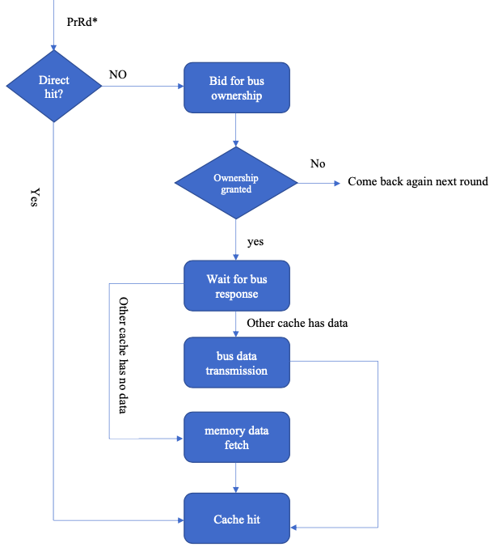
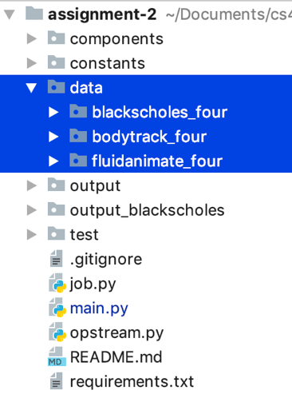

# Multi-Core_Cache_Coherence_Simulation

## Introduction

This is a course project for exploring different Cache coherence protocols.  A report is also provided [here](./report.pdf)

There are three protocols in our implementations:

* MESI

  

* MOESI

  

* Dragon

  

## Flowchart



## Our Implementation

* Language: Python 3

* Setup

  ```
  pip install -r requirements.txt
  ```

* Folder structure

  * make sure the data folder is put under the root directory of the source code



* Run, e.g.

  ```
   ./coherence.sh MESI ./data/bodytrack_four 1024 1 16
  ```

* Sample Output


## Evaluation:

Our evaluation is based [Princeton's PARSEC](https://parsec.cs.princeton.edu/overview.htm) Multiprocessor Benchmark. Specifically, we choose three traces in PARSEC:

* blackscholes
* bodytrack
* fluidanimate

**Configuration:** 

​	4KB 2-way associative cache, block size 32 bytes, word size 4 bytes

Results are shown below:

1. Black Scholes

|                                | MESI               |          |          |          |
| ------------------------------ | ------------------ | -------- | -------- | -------- |
|                                | P0                 | P1       | P2       | P3       |
| Compute Cycles                 | 10430314           | 10383276 | 10430338 | 10394904 |
| Load/Store Instructions        | 2497349            | 2490468  | 2509057  | 2503127  |
| Idle Cycles                    | 6636123            | 6589273  | 7549819  | 6726709  |
| Cache Miss Rate                | 0.01               | 0.01     | 0.01     | 0.01     |
| Bus Data Traffic (Byte)        | 697216             |          |          |          |
| Bus Invalidation/Updates       | 23290              |          |          |          |
| Overall Execution Cycle        | 17980157           |          |          |          |
| Private Data Access Percentage | 81                 |          |          |          |
|                                | **DRAGON**         |          |          |          |
|                                | P0                 | P1       | P2       | P3       |
| Idle Cycles                    | 6640924            | 6610163  | 7556377  | 6734058  |
| Cache Miss Rate                | 0.01               | 0.01     | 0.01     | 0.01     |
| Bus Data Traffic (Byte)        | 715456             |          |          |          |
| Bus Invalidation/Updates       | 26496              |          |          |          |
| Overall Execution Cycle        | 17986715           |          |          |          |
| Private Data Access Percentage | 81                 |          |          |          |
|                                | **MOESI**          |          |          |          |
|                                | P0                 | P1       | P2       | P3       |
| Idle Cycles                    | 6635323            | 6575998  | 7547403  | 6725986  |
| Cache Miss Rate                | 0.01               | 0.01     | 0.01     | 0.01     |
| Bus Data Traffic (Byte)        | 693408             |          |          |          |
| Bus Invalidation/Updates       | 23293              |          |          |          |
| Overall Execution Cycle        | 17977741           |          |          |          |
| Private Data Access Percentage | 81                 |          |          |          |
|                                | **DRAGON-noflush** |          |          |          |
|                                | P0                 | P1       | P2       | P3       |
| Idle Cycles                    | 6643822            | 6603519  | 7556814  | 6732024  |
| Cache Miss Rate                | 0.01               | 0.01     | 0.01     | 0.01     |
| Bus Data Traffic (Byte)        | 693408             |          |          |          |
| Bus Invalidation/Updates       | 23293              |          |          |          |
| Overall Execution Cycle        | 17987152           |          |          |          |
| Private Data Access Percentage | 81                 |          |          |          |

 

2. Body Track

|                                | MESI               |          |          |          |
| ------------------------------ | ------------------ | -------- | -------- | -------- |
|                                | P0                 | P1       | P2       | P3       |
| Compute Cycles                 | 17729254           | 17120545 | 17556877 | 17140113 |
| Load/Store Instructions        | 3270132            | 3287252  | 117698   | 3324919  |
| Idle Cycles                    | 21819530           | 22859061 | 1299568  | 22420204 |
| Cache Miss Rate                | 0.03               | 0.04     | 0.04     | 0.03     |
| Bus Data Traffic (Byte)        | 4984160            |          |          |          |
| Bus Invalidation/Updates       | 59476              |          |          |          |
| Overall Execution Cycle        | 39979606           |          |          |          |
| Private Data Access Percentage | 71                 |          |          |          |
|                                | **DRAGON**         |          |          |          |
|                                | P0                 | P1       | P2       | P3       |
| Idle Cycles                    | 21675503           | 22715113 | 1288849  | 22276250 |
| Cache Miss Rate                | 0.03               | 0.04     | 0.04     | 0.03     |
| Bus Data Traffic (Byte)        | 5064828            |          |          |          |
| Bus Invalidation/Updates       | 60975              |          |          |          |
| Overall Execution Cycle        | 39835658           |          |          |          |
| Private Data Access Percentage | 70                 |          |          |          |
|                                | **MOESI**          |          |          |          |
|                                | P0                 | P1       | P2       | P3       |
| Idle Cycles                    | 21542930           | 22582461 | 1289866  | 22143604 |
| Cache Miss Rate                | 0.03               | 0.04     | 0.04     | 0.03     |
| Bus Data Traffic               | 5292992            |          |          |          |
| Bus Invalidation/Updates       | 59541              |          |          |          |
| Overall Execution Cycle        | 39703006           |          |          |          |
| Private Data Access Percentage | 69                 |          |          |          |
|                                | **DRAGON-noflush** |          |          |          |
|                                | P0                 | P1       | P2       | P3       |
| Idle Cycles                    | 21645736           | 22685346 | 1296561  | 22246483 |
| Cache Miss Rate                | 0.03               | 0.04     | 0.04     | 0.03     |
| Bus Data Traffic               | 5053300            |          |          |          |
| Bus Invalidation/Updates       | 60880              |          |          |          |
| Overall Execution Cycle        | 39805891           |          |          |          |
| Private Data Access Percentage | 71                 |          |          |          |

 

 

3. Fluid Animate

|                                | MESI               |          |          |          |
| ------------------------------ | ------------------ | -------- | -------- | -------- |
|                                | P0                 | P1       | P2       | P3       |
| Compute Cycles                 | 11337782           | 11290799 | 11337671 | 11301515 |
| Load/Store Instructions        | 2576503            | 2407844  | 2604189  | 2411465  |
| Idle Cycles                    | 33174662           | 31502225 | 37946761 | 38935559 |
| Cache Miss Rate                | 0.03               | 0.02     | 0.03     | 0.02     |
| Bus Data Traffic (Byte)        | 1168832            |          |          |          |
| Bus Invalidation/Updates       | 287074             |          |          |          |
| Overall Execution Cycle        | 50237074           |          |          |          |
| Private Data Access Percentage | 84                 |          |          |          |
|                                | **DRAGON**         |          |          |          |
|                                | P0                 | P1       | P2       | P3       |
| Idle Cycles                    | 33132852           | 31431073 | 37840315 | 38870638 |
| Cache Miss Rate                | 0.03               | 0.02     | 0.03     | 0.02     |
| Bus Data Traffic (Byte)        | 1119728            |          |          |          |
| Bus Invalidation/Updates       | 289340             |          |          |          |
| Overall Execution Cycle        | 50172153           |          |          |          |
| Private Data Access Percentage | 85                 |          |          |          |
|                                | **MOESI**          |          |          |          |
|                                | P0                 | P1       | P2       | P3       |
| Idle Cycles                    | 33077951           | 31380752 | 37798948 | 38787746 |
| Cache Miss Rate                | 0.03               | 0.02     | 0.03     | 0.02     |
| Bus Data Traffic (Byte)        | 1171584            |          |          |          |
| Bus Invalidation/Updates       | 287074             |          |          |          |
| Overall Execution Cycle        | 50089261           |          |          |          |
| Private Data Access Percentage | 84                 |          |          |          |
|                                | **DRAGON-noflush** |          |          |          |
|                                | P0                 | P1       | P2       | P3       |
| Idle Cycles                    | 33055461           | 31350984 | 37780509 | 38747811 |
| Cache Miss Rate                | 0.03               | 0.02     | 0.03     | 0.02     |
| Bus Data Traffic (Byte)        | 1116296            |          |          |          |
| Bus Invalidation/Updates       | 289397             |          |          |          |
| Overall Execution Cycle        | 50049326           |          |          |          |
| Private Data Access Percentage | 85                 |          |          |          |

 